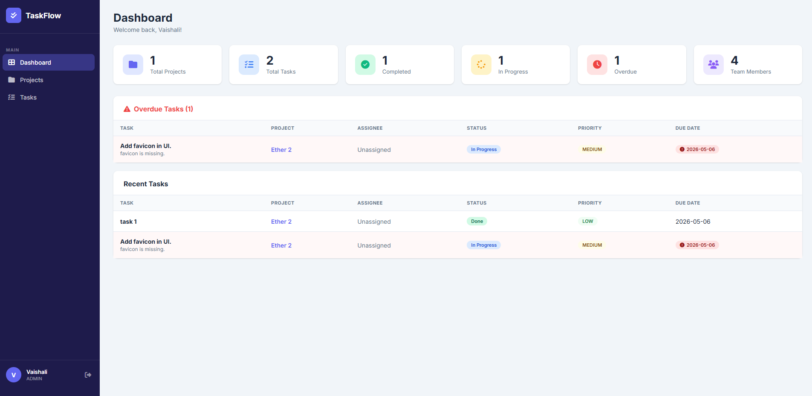
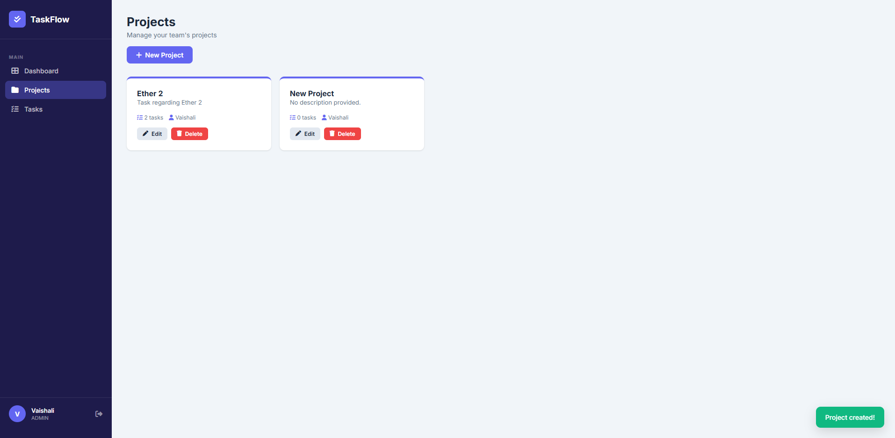
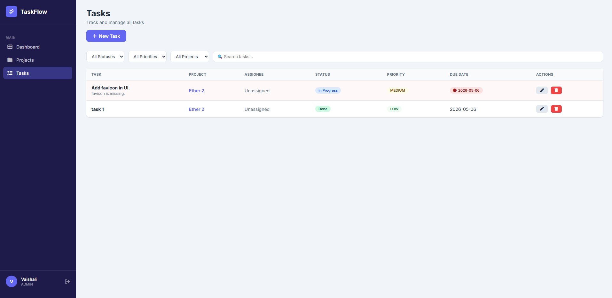

# 📋 TaskFlow – Team Task Manager

A full-stack web application for managing projects, assigning tasks, and tracking team progress with role-based access control (Admin/Member).

🌐 **Live Demo:** [https://task-manager-production-e8cc.up.railway.app/](https://task-manager-production-e8cc.up.railway.app/)

---

## ✨ Features

- 🔐 **Authentication** – JWT-based signup & login with role selection
- 👥 **Role-Based Access** – Admin can create/edit/delete; Members can view & update task status
- 📁 **Project Management** – Create and manage multiple projects
- ✅ **Task Management** – Create tasks with status, priority, due date & assignee
- 📊 **Dashboard** – Live stats: total tasks, completed, in-progress, overdue
- ⚠️ **Overdue Detection** – Automatically highlights tasks past their due date
- 🔍 **Filtering** – Filter tasks by status, priority, project or search by name

---

## 🛠️ Tech Stack

| Layer | Technology |
|---|---|
| Backend | Java 21, Spring Boot 3.5 |
| Security | Spring Security 6, JWT |
| Database | MySQL 8 |
| ORM | Hibernate / Spring Data JPA |
| Frontend | Vanilla JS, HTML5, CSS3 |
| Deployment | Railway |
| Build Tool | Maven |

---

## 🚀 Getting Started (Local)

### Prerequisites
- Java 21+
- Maven 3.8+
- MySQL 8+

### 1. Clone the repository
```bash
git clone https://github.com/vaishali0001/task-manager.git
cd task-manager
```

### 2. Create MySQL database
```sql
CREATE DATABASE taskmanager;
```

### 3. Configure `application.properties`
```properties
spring.datasource.url=jdbc:mysql://localhost:3306/taskmanager?createDatabaseIfNotExist=true&useSSL=false&allowPublicKeyRetrieval=true&serverTimezone=UTC
spring.datasource.username=root
spring.datasource.password=your_password
jwt.secret=yourSuperSecretKeyAtLeast32Characters!!
```

### 4. Run the app
```bash
mvn clean package -DskipTests
java -jar target/TaskManager-0.0.1-SNAPSHOT.jar
```

### 5. Open in browser
```
http://localhost:8080
```

---

## 📡 API Endpoints

### Auth
| Method | Endpoint | Access | Description |
|---|---|---|---|
| POST | `/api/auth/register` | Public | Register new user |
| POST | `/api/auth/login` | Public | Login & get JWT token |

### Projects
| Method | Endpoint | Access | Description |
|---|---|---|---|
| GET | `/api/projects` | All | Get all projects |
| POST | `/api/projects` | Admin | Create project |
| PUT | `/api/projects/{id}` | Admin | Update project |
| DELETE | `/api/projects/{id}` | Admin | Delete project |

### Tasks
| Method | Endpoint | Access | Description |
|---|---|---|---|
| GET | `/api/tasks` | All | Get all tasks |
| POST | `/api/tasks` | Admin | Create task |
| PUT | `/api/tasks/{id}` | All | Update task |
| DELETE | `/api/tasks/{id}` | Admin | Delete task |

### Dashboard
| Method | Endpoint | Access | Description |
|---|---|---|---|
| GET | `/api/dashboard/stats` | All | Get stats summary |

---

## 🗂️ Project Structure

```
src/
├── main/
│   ├── java/com/TaskManager/TaskManager/
│   │   ├── config/          # Security configuration
│   │   ├── controller/      # REST controllers
│   │   ├── dto/             # Request/Response DTOs
│   │   ├── entity/          # JPA entities
│   │   ├── enums/           # Role, TaskStatus, Priority
│   │   ├── exception/       # Global exception handler
│   │   ├── repository/      # Spring Data repositories
│   │   ├── security/        # JWT filter & user details
│   │   └── service/         # Business logic
│   └── resources/
│       ├── static/
│       │   └── index.html   # Frontend SPA
│       └── application.properties
```

---

## 🔒 Role-Based Access

| Feature | Admin | Member |
|---|---|---|
| Register / Login | ✅ | ✅ |
| View Projects | ✅ | ✅ |
| Create / Edit / Delete Projects | ✅ | ❌ |
| View Tasks | ✅ | ✅ |
| Create / Delete Tasks | ✅ | ❌ |
| Update Task Status | ✅ | ✅ |
| View Dashboard | ✅ | ✅ |

---

## ☁️ Deployment (Railway)

This app is deployed on [Railway](https://railway.app) with a managed MySQL database.

### Environment Variables required:
| Variable | Description |
|---|---|
| `SPRING_DATASOURCE_URL` | MySQL JDBC connection string |
| `SPRING_DATASOURCE_USERNAME` | Database username |
| `SPRING_DATASOURCE_PASSWORD` | Database password |
| `JWT_SECRET` | Secret key for signing JWT tokens |
| `PORT` | Injected automatically by Railway |

---

## 📸 Screenshots

> Dashboard, Projects, and Tasks pages with role-based UI.

> 
> 
---

## 👩‍💻 Author

**Vaishali** – [github.com/vaishali0001](https://github.com/vaishali0001)

---
